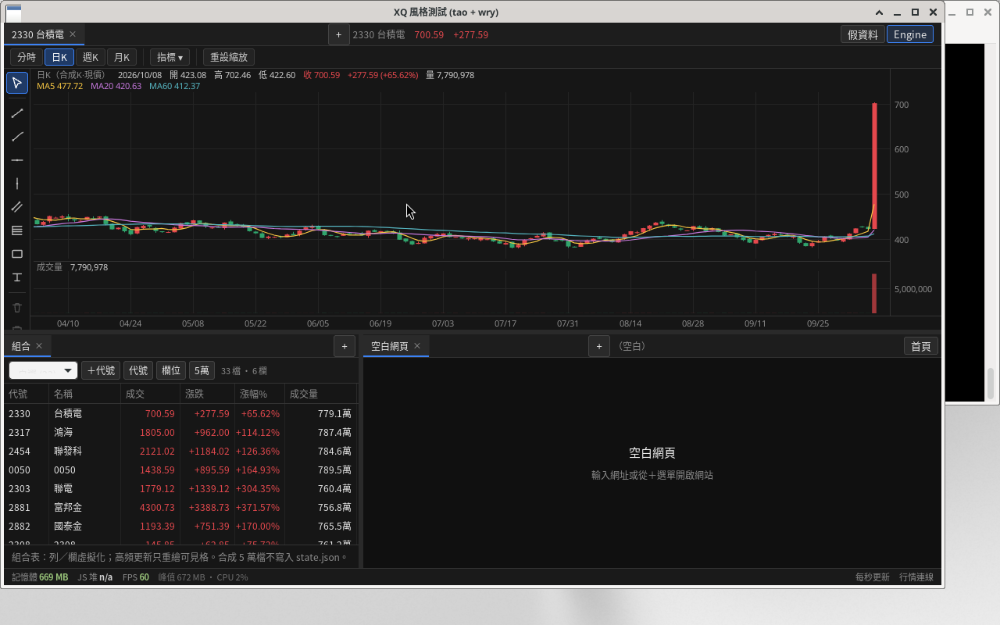
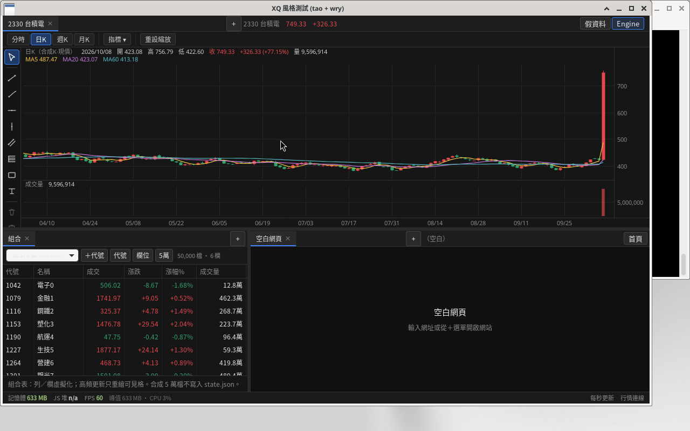
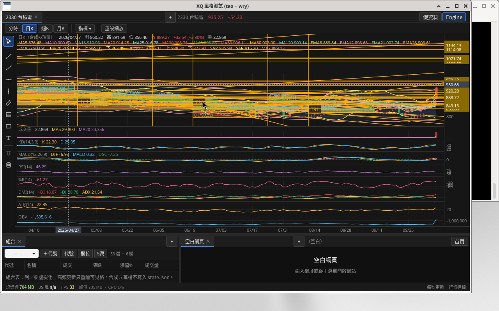
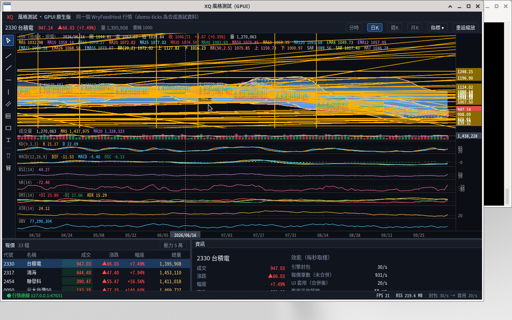
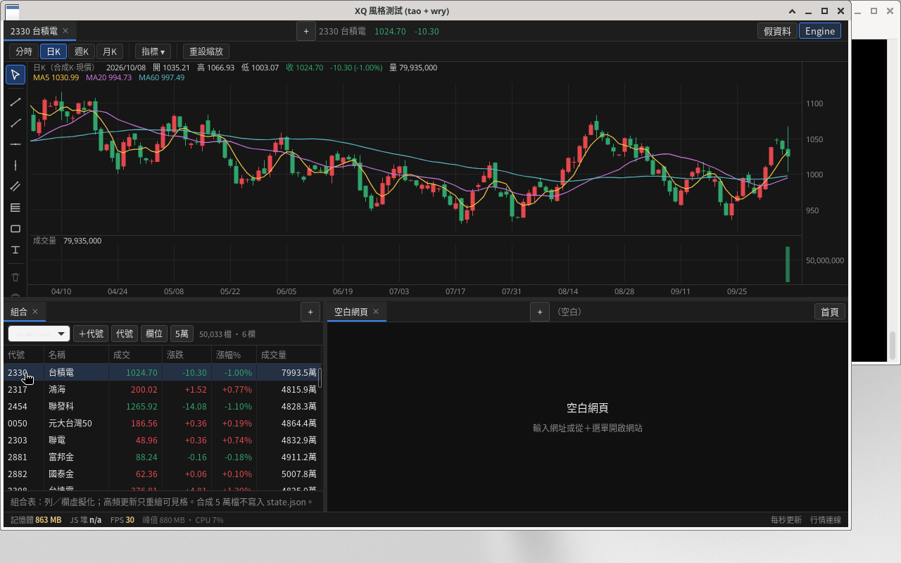
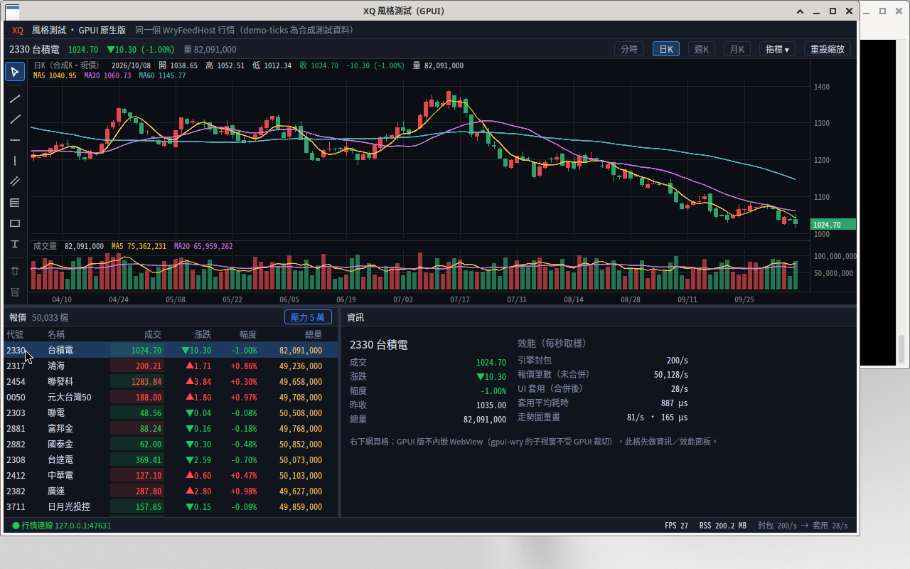
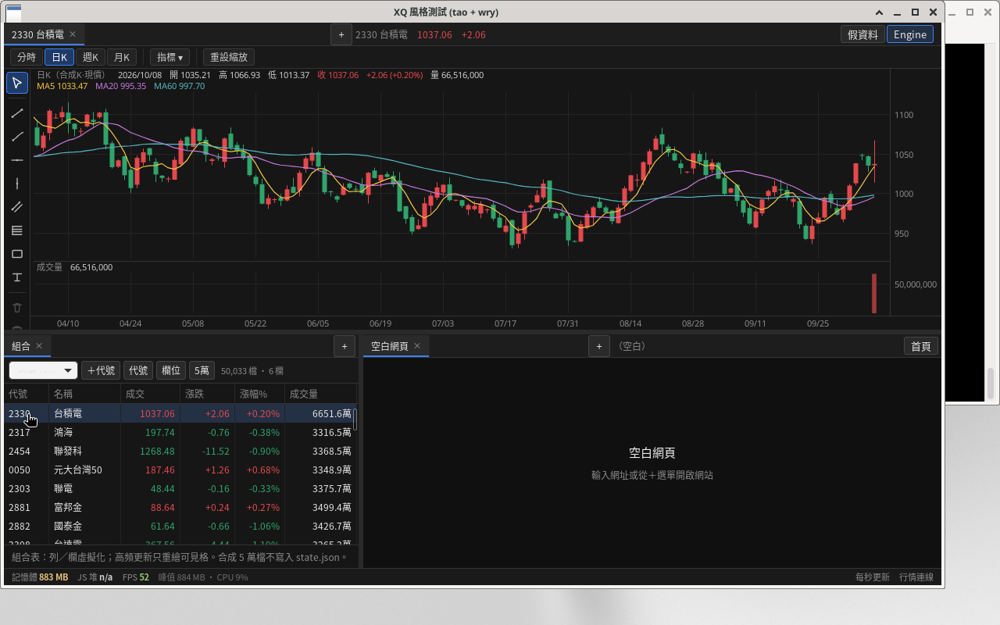
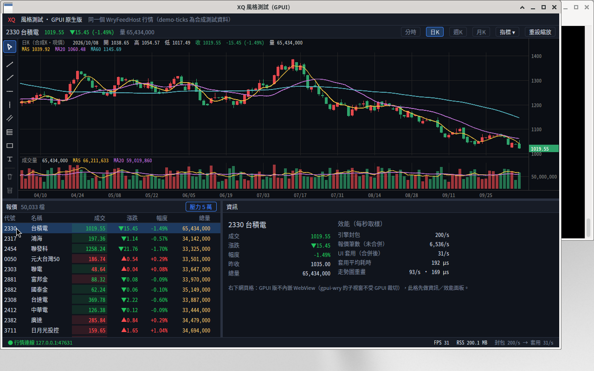

# wry-xq-demo

XQ 風格桌面示範：Rust（**tao** 視窗 + **wry** WebView）開原生視窗，畫面以 HTML／CSS／JS 繪製。


## 架構（tao + wry）

- **主 WebView**：鋪滿視窗，負責三格版面、走勢圖 Canvas、報價／自選／記事、分割線與狀態列。
- **子 WebView**：疊在右下格，載入**真實網站**（不受 `X-Frame-Options` 限制）。JS 以 `ipc` 回報格位像素，Rust 呼叫 `set_bounds` 跟著分割線移動。
- Linux 主畫面走 GTK 嵌入；右下子 WebView 仍為 X11 子視窗（**僅支援 X11**，Wayland 不行）。Windows／macOS 兩個 WebView 皆為視窗子元件。

## 三格版面與分頁

| 區塊 | 分頁 |
|------|------|
| **上** 走勢圖 | 獨立圖表分頁，軟上限 **16**；各分頁自有代號／週期／畫線／指標（鍵：`tabId\|symbol\|period`） |
| **左下** | **報價**、**自選**、**組合**（虛擬化大表）、**記事**（可多開） |
| **右下** 網頁 | 多個網頁分頁共用同一個子 WebView；切走後**延遲約 20 秒**再載入新頁／卸載（期間切回可保暖、深色占位減白閃），逾時釋放 Yahoo 等重站 RSS |

分割線可水平／垂直拖拉；點報價可同步上方圖表與右下網頁。

## 畫線工具列（Longbridge 風格）

走勢圖左側常駐垂直工具列（`draw-rail`）：游標、趨勢線、射線、水平／垂直線、平行通道、費波納契回撤、矩形、文字註記，以及刪除／全部清除。作用中工具會高亮；週期與「指標」仍在上方工具列。

## 技術指標

- **主圖疊加**（overlays）：最多 **20** 組實例，可重複同類型不同參數 — MA、EMA、布林、SAR。
- **副圖**：最多 **10** 格，一律排在主圖下方、與 K 線共用時間軸；指標含成交量、KD、MACD、RSI、威廉、DMI、ATR、OBV。
- 週期：分時／日 K／週 K／月 K。

## 畫線與持久化

畫線與指標、分頁、自選、記事等寫入 `window.XQ_STATE`，經 ipc `{type:"save"}` 由 Rust 存成 JSON：

- Windows：`%APPDATA%\wry-xq-demo\state.json`
- macOS：`~/Library/Application Support/wry-xq-demo/state.json`
- Linux：`$XDG_DATA_HOME/wry-xq-demo/state.json`（或 `~/.local/share/...`）

下次啟動以初始化腳本注入（比 `localStorage` 可靠；WebView2 的 `with_html` 頁面為 `about:blank`）。


## 組合／報價大表（虛擬化）

左下 **組合** 分頁：針對交易室等級的自選／族群表。

- **規模**：單一組合可載入 **5 萬+** 檔（合成假資料做壓力測試；合成組合**不寫入** `state.json`）。
- **欄位**：使用者可增刪／重排／改名／調寬，硬上限 **100** 欄；設定與可編輯組合的代號清單非同步寫入 `state.json`。
- **效能**：列＋欄雙向虛擬化（只建可見 DOM）；行情 tick 只標記髒列、rAF 增量更新可見格；禁止整表重建。
- **編輯**：工具列可加代號、編輯代號清單、編輯欄位；拖曳表頭右緣調寬。
- 壓測：`XQ_GROUP_STRESS=1` 啟動後自動跑 5 萬列 × 多欄 + 高頻 tick + 捲動，結果以 `GROUPPERF|…` 印到 stderr。

## 狀態列

視窗底部顯示 **記憶體**（主行程 + WebView／WebKit 子行程 RSS）、**JS 堆**（有則顯示）、**FPS**（獨立 rAF 計幀）。約每秒更新，**不走行情 tick 熱路徑**。

## 執行

需求：

- **Rust ≥ 1.88**（見 `Cargo.toml` 的 `rust-version`）
- **Windows**：WebView2（Windows 10／11 多半內建）
- **Linux**：WebKitGTK 4.1，嵌入網頁僅 **X11**
- **macOS**：系統 WebKit

```bash
cargo run
# 建議日常／測記憶體用 Release（比 debug 明顯省 CPU／RSS）
cargo run --release
```

選用環境變數：`XQ_DEBUG=1`（ipc 除錯）、`XQ_TAB_STRESS=1`（16 走勢圖分頁切換壓測）、`XQ_GROUP_STRESS=1`（組合表 5 萬列壓測；可用 `XQ_STRESS_COLS`／`XQ_STRESS_TICK_HZ`／`XQ_STRESS_TICK_MS`／`XQ_STRESS_SCROLL_MS` 改欄數、跳價頻率與時間，預設 40 欄、3000 筆/s、各 2 秒）、`XQ_BENCH=1`（第一幀／第一筆報價／每秒 FPS 印到 stderr，給 `scripts/bench-main-window.sh` 用）。

### 記憶體：右下網頁延遲卸載（少閃）

子 WebView 同時只常駐**一個**頁面。切到其他網頁分頁時：

1. **先深色占位**並把子 WebView 縮成 1×1（不露 `about:blank` 白屏）。
2. **約 20 秒內**仍保留上一頁在 WebKit（保暖）；期間切回上一分頁可**立即顯示**。
3. 逾時或按「立即載入」才導向新 URL（同時釋放舊頁 RSS，例如 Yahoo 可省約數百 MB）。
4. 載入完成前維持占位，完成後再鋪回子 WebView。

啟動、新分頁、首頁仍會立即載入。分頁標題與 URL 仍寫在 `state.json`。雙 WebView 架構不變。

標題列可選「假資料」或「Engine」。假資料不向 XQNext 訂閱；Engine 的報價與分時來自 XQNext（經本機 WryFeedHost），日 K 仍是合成的，最後一根跟著現價。

## Engine 行情（WryFeedHost）

真實報價／分時由旁邊的 **WryFeedHost**（`feedhost/`）推到 `127.0.0.1:47631`，協定與 `src/engine.rs` 一致（LE u32 長度前綴二進位；**不要**在 hot path 用 JSON）。

### Windows（建議：XQNext 旁掛）

1. 啟動並**登入** XQNext（需要 SysJust 帳密／token；未登入則 `hello.ready=0`，沒有即時行情）。
2. 編譯並執行 WryFeedHost：

   ```bat
   cd feedhost
   dotnet build -c Release
   dotnet run --project WryFeedHost -c Release
   ```

3. 再 `cargo run` 本專案，標題列選 **Engine**。

- **空訂閱**（0 個代號，例如切回「假資料」）= 取消訂閱／放下 FieldPool。
- 目前 `EngineBridge` 已接好 TCP 協定與訂閱狀態機；真正的 `RT_RefQuote2`／`KData_Min`／FieldPool 仍需在 Windows 上接 `DAQEngine.Client`（套件提示 `XQData.DAQEngine.Client` 0.43.0）與登入憑證。詳見 [feedhost/README.md](feedhost/README.md)。

### Linux／Wine 限制

XQNext 的 WPF UI 在 Wine 下會因字型等問題崩潰；即便 Engine 行程起來，**Named Pipe 也不會出現**，無法當正式即時源。請在 **Windows** 上跑 XQNext + WryFeedHost。

### 協定路徑測試（非即時）

```bash
dotnet run --project feedhost/WryFeedHost -c Release -- --demo-ticks
```

清楚標示為 **path-test**，推送合成高頻二進位報價／分鐘線，**不是**嘉實即時行情。


## Windows 安裝檔

Inno Setup 繁中安裝程式腳本與打包說明見 [installer/README.md](installer/README.md)。

```bash
# Linux：交叉編譯 x86_64-pc-windows-gnu + Wine 編譯 Inno → dist/wry-xq-demo-setup-0.1.0.exe
./scripts/package-windows.sh
```

正式發佈建議在 Windows 用 MSVC 編譯後再跑同一腳本（或手動開 `installer/wry-xq-demo.iss`）。安裝後右下網頁分頁預設仍為空白（`about:blank`）。

## 文件

- [效能設計原則](docs/performance-principles.md) — HFT 看盤心態、增量更新、虛擬化、畫線／分頁快取、壓測數字與檢查清單。

## 效能備註（壓力測試摘要）

測試環境：Linux WebKitGTK、無獨立 GPU（偏悲觀；Windows WebView2 + GPU 通常更快）。Canvas 2D。

- **畫線快取**：靜態畫線離屏快取 + 空間索引 hitTest；混合 1000 筆工具重繪約 **15.5 ms → ~0.9 ms**。
- **最重負載**（20 疊加、8 副圖、1000 畫線 + 高頻 tick）：連續 tick 約 **~38 FPS**；十字線+tick ~32 FPS；平移因重建畫線層較慢（~27 FPS）。輕量基準約 60 FPS；RSS 約 600–750 MB（含 WebKit）。
- **組合表**（Linux WebKitGTK）：5 萬列 × 40 欄、~3000 tick/s → **tick ~61 FPS**、捲動 **~55 FPS**、scroll jank 0、可見格重繪 ~1 ms；RSS（含 WebKit）約 **1.1 GB**（合成 5 萬列常駐記憶體）。硬上限 100 欄。
- **16 走勢圖分頁**：切換先貼快照再延遲完整重繪；`paintFirst` 約 **3–4 ms**（p95），settle（含完整 render）約 **~57 ms**。另有 series LRU、平移 translate-cache、指標末棒增量更新等。

## 主視窗成本比較（wry vs GPUI）

同一個行情來源、同一份畫面內容，各開**一個主視窗**的成本。對照專案：[tina-moneydj/gpui-xq-demo](https://github.com/tina-moneydj/gpui-xq-demo)（GPUI 原生繪圖版）。

- **測試日期**：2026-10-08（Asia/Taipei 12:24–12:35）；每個情境兩邊各跑 **3 次取中位數**，兩個程式輪流跑（WryFeedHost 一次只服務一個 client）。
- **環境**：Linux box（Debian 13，kernel 6.12，8 vCPU Intel Xeon，**沒有 GPU**），Xvfb `:2` 1280×800＋xfwm4（X11）。
  wry 版＝WebKitGTK 2.54（`WEBKIT_DISABLE_COMPOSITING_MODE=1`）；GPUI 版＝`gpui-pre 0.3.7` 走 Vulkan，由 **Mesa 25.0.7 lavapipe 軟體光柵**。
  行情：`WryFeedHost --demo-ticks`（合成資料，約 30 包／900 筆報價每秒），測前重啟過 feedhost。兩邊都是 release build。
- **同樣的畫面**：視窗 1200×720、33 檔自選（同 `gpui-xq-demo/src/names.rs`）、單一走勢圖＝**2330 日線（合成日 K）＋MA5/20/60＋成交量**、
  左下報價表 6 欄（代號／名稱／成交／漲跌／幅度／總量）、右下空白（wry 是 `about:blank`，**不建子 WebView**；GPUI 是資訊格）、不開壓力 5 萬。
  wry 的 `state.json` 測試時換成同內容的最小設定（1 個走勢分頁、左下只有「組合」分頁），測完還原。
- **方法**（[`scripts/bench-main-window.sh`](scripts/bench-main-window.sh)，可重跑：`scripts/bench-main-window.sh 3 all`）：
  - 啟動：launch → 視窗出現（`xdotool` 輪詢）→ 第一幀畫完／第一筆報價畫上畫面（程式在 `XQ_BENCH=1` 時印 `BENCH first-frame`／`BENCH first-quote`，腳本收到時打時間戳）。
  - 記憶體：主行程＋所有子行程（wry：`WebKitWebProcess`、`WebKitNetworkProcess`）的 RSS，以及 PSS（`/proc/*/smaps_rollup`，共用函式庫按比例分攤，比較公平）。
  - CPU：所有行程（含所有執行緒）`utime+stime` 在 30 秒內的平均；100% = 一顆核心。另外依執行緒名稱拆出「軟體光柵（`llvmpipe` 執行緒）」佔多少。
  - FPS：程式自己回報（wry：狀態列 rAF 計幀；GPUI：每秒實際畫出的 frame 數），取 30–60 秒平均。

### 一般情境（開一個主視窗、行情持續跳動）

| 項目（中位數，3 次） | wry（tao + wry / WebKitGTK） | GPUI（原生繪圖） |
|---|---|---|
| 啟動 → 視窗出現 | 228 ms | 261 ms |
| 啟動 → 第一幀畫完 | 986 ms | **285 ms** |
| 啟動 → 第一筆報價上畫面 | 917 ms¹ | **398 ms** |
| RSS 合計，t=10s | 600 MB | **182 MB** |
| RSS 合計，t=60s | 674 MB（主程式 195＋WebKitWebProcess 413＋Network 60）² | **182 MB**（單一行程） |
| PSS 合計，t=10s / t=60s | 414 / 477 MB | **178 / 178 MB** |
| 行程數／執行緒數 | 3／80 | **1／53** |
| CPU（30 秒平均，全部行程） | **181%** | 246% |
| 　└ 其中軟體光柵（llvmpipe 執行緒）³ | ≈ 102% | ≈ 224% |
| 　└ 扣掉軟體光柵（程式本身＋瀏覽器引擎）³ | ≈ 79%（WebKit 主執行緒 65%、wry 主程式 8%） | **≈ 22%** |
| FPS（程式回報） | 59.5（rAF 計幀，不代表每幀都有重畫） | 27.7（實際畫出的幀；被 lavapipe 每幀約 30 ms 卡住） |
| 執行檔大小 | **1.6 MB**（另需系統 WebKitGTK 4.1：`libwebkit2gtk` 96 MB＋`libjavascriptcoregtk` 33 MB；Windows 用系統 WebView2，安裝檔 3.1 MB） | 25.1 MB（單一執行檔，strip＋thin LTO；只需 Vulkan/GL 驅動） |

¹ wry 的第一筆報價和第一幀幾乎落在同一幀（兩個標記都是「兩次 rAF 後」送出，順序會互換）。
² wry 的 RSS 在開頭 60 秒內會從 600 爬到 674 MB（JS heap／WebKit 快取暖身）；GPUI 從第 10 秒起就持平。
³ 執行緒拆分取第 3 次的數字。

### 壓力情境（5 萬列報價表＋高頻跳價＋捲動）

兩邊都開 **5 萬列合成表、6 欄**，每秒 **3000 筆合成跳價**（30 Hz 分批、隨機挑列，同 wry 版 `applyTicks`），
先只跳價 **30 秒**、再邊跳價邊上下正弦捲動 **10 秒**；行情 feed 照常進來。
wry：`XQ_GROUP_STRESS=1 XQ_STRESS_COLS=6 XQ_STRESS_TICK_MS=30000 XQ_STRESS_SCROLL_MS=10000`；
GPUI：`XQ_GROUP_STRESS=1`（同一組 `XQ_STRESS_*` 參數），結果都以 `GROUPPERF|{json}` 印出。

| 項目（中位數，3 次） | wry | GPUI |
|---|---|---|
| RSS／PSS，跳價 30 秒時（約 t=32s） | 623／426 MB | **187／183 MB**（比一般情境只多 ≈ 4 MB） |
| RSS／PSS，捲動中（約 t=40s） | 647／456 MB | **186／183 MB** |
| CPU，跳價 30 秒 | **171%** | 298%（其中 llvmpipe ≈ 272%） |
| CPU，捲動 10 秒 | **192%** | 305% |
| FPS，跳價中 | 59.5（rAF） | 35.8（實際幀） |
| FPS，捲動中 | 59.7（rAF） | 35.5（實際幀） |
| 捲動卡頓（幀間隔 > 32 ms） | 1 次（平均 35 ms） | 140 次（平均 33.1 ms，即穩定 ~30 fps 的幀距） |
| 可見格更新，跳價中 | 0.36 ms／次、約 1 格／次（只重畫髒列；30 秒 769 次） | **0.09 ms**／次、84 格／次（整個可見範圍重建；30 秒 1074 次） |
| 可見格更新，捲動中 | 1.15 ms／次、120 格／次（10 秒 834 次） | **0.09 ms**／次、84 格／次（10 秒 355 次） |

兩邊的差異（盡量對齊，但仍不完全相同）：
- 表格內容：wry 是純合成組合（50,000 列）；GPUI 是 33 檔真實自選＋50,000 合成列（最上面是真實列）。
- 更新策略：wry 只重畫「可見且有變」的格；GPUI 每次表格有變就重建整個可見範圍（14 列×6 欄），但每次只要 ~0.09 ms。
- 「可見格更新」只算組資料的時間：wry＝JS 組 DOM 字串＋`innerHTML`；GPUI＝建立可見列的元素樹。都**不含**版面計算與光柵化。
- 捲動驅動：wry 用 rAF（跟顯示同步）；GPUI 用 16 ms 計時器。可見列數：wry 約 20 列（含 overscan）、GPUI 14 列。
- FPS 定義不同（見上表）。

### 結論

- **記憶體**：GPUI 版約是 wry 版的 **1/3.7（RSS 182 vs 674 MB）**，PSS 也只有 **~37%**（178 vs 477 MB），而且只有一個行程、不隨時間增長；
  5 萬列壓力表對兩邊都不太加記憶體（虛擬化），GPUI 只多約 4 MB。
- **啟動**：視窗出現時間差不多（~0.25 s），但 GPUI **~0.3 s 就畫出內容**、0.4 s 有報價；wry 要等 WebKit 子行程起來、載入 HTML/JS，約 **0.9–1.0 s**。
- **CPU／FPS（這台沒有 GPU）**：GPUI 看起來比較吃 CPU、FPS 也較低，原因是 lavapipe 用 CPU 光柵化**整個視窗每一幀**（佔它 CPU 的 ~90%）；
  扣掉軟體光柵，GPUI 本身只用 **~22%**，wry（WebKit 主執行緒＋主程式）約 **~79%**。有實體 GPU 時 GPUI 的光柵化交給 GPU，CPU 與 FPS 會大幅改善；
  wry 在 Windows／macOS 也會改用 GPU 合成，數字同樣會不同。
- GPUI 表格還能再省：只在跳價的列落在可見範圍時才 `notify`（wry 版已經這樣做）。

### 注意事項

- 這是**沒有 GPU 的 Linux／Xvfb**：兩邊都靠 Mesa 軟體光柵（WebKit 也有 ~100% 的 `llvmpipe` 執行緒）。Windows（WebView2／DirectX）、macOS（WKWebView／Metal）的絕對數字會不同，請在目標機器重跑。
- wry 的 FPS 是 rAF 回呼次數（主執行緒沒被卡住就接近 60），GPUI 的 FPS 是實際畫出的幀數（沒變化就不畫），**兩者不能直接比**；看卡不卡要對照捲動卡頓與 CPU。
- demo-ticks 價格有向上漂移，測試約 25 分鐘內 2330 漲了 ~70%（假資料特性，不影響成本量測）。
- RSS 會重複計算共用函式庫（WebKit 三個行程共用很多 .so），所以同時列 PSS。
- 截圖（t≈60s／壓力跳價中）：

| wry | GPUI |
|---|---|
|  |  |
|  |  |

原始數據：[`docs/bench/summary.json`](docs/bench/summary.json)、[`docs/bench/results.json`](docs/bench/results.json)。

### 重圖表壓測（1000 畫線＋多指標）

上面兩個情境的走勢圖都很輕（MA×3＋成交量）。這一節把**同一個主視窗**的走勢圖塞到最重，比較看盤畫面最吃資源的情況。

- **測試日期**：2026-10-08（Asia/Taipei 13:15–13:19）；兩邊各跑 **3 次取中位數**，輪流跑（WryFeedHost 一次只服務一個 client），量測前重啟過 feedhost（避免 demo 價格漂移）。
- **環境**：同上（8 vCPU、**沒有 GPU**、Xvfb `:2`、WebKitGTK 2.54 `WEBKIT_DISABLE_COMPOSITING_MODE=1` Canvas 2D／`gpui-pre 0.3.7` wgpu → Mesa lavapipe），release build，視窗 1200×720。
- **同樣的負載**（兩邊同一套定義，GPUI 版照 wry `__perfSetupStress`／`__perfAddN`／`__perfContinuous` 移植）：
  - 2330 **日 K 1200 根**（合成，最後一根跟著現價）。
  - **主圖疊加 20 個**：MA×11（5、10、15、20、25、30、40、50、60、120、7）、EMA×5（8、12、21、26、55）、布林×2（20,2／50,2.5）、SAR×2（0.02/0.2、0.04/0.3）。
  - **副圖 8 個**共用時間軸：成交量＋均量 MA5/20、KD、MACD、RSI、威廉 %R、DMI、ATR、OBV。
  - **畫線 1000 筆**，同一個產生公式：趨勢線 40%、射線 8%、水平線 8%、垂直線 8%、平行通道 12%、費波納契 12%、矩形 6%、文字 6%。
  - **走勢圖 canvas 同為 1166×512**：1200×720 的預設上下比例下，20 個疊加的圖例＋8 個副圖會把主圖擠到只剩幾個像素，所以兩邊都把上方走勢圖放大
    （wry `XQ_CHART_TOP_RATIO=0.8`、GPUI `XQ_TOP_FRAC=0.811`；實際尺寸兩邊都在 `CHARTPERF setup` 印出確認）。
- **流程**（`XQ_CHART_STRESS=1` 自動執行）：等第一筆真實報價 → 300 ms 後套用上述負載（印 `BENCH heavy-frame`）→ 暖身 3 秒 → 三段各 **10 秒**：
  - **ticks**：每一幀跳一筆合成價（`最後收盤 + sin(f/7)×0.15`、量 +1），所有指標更新最後一根；
  - **crosshair**：跳價＋十字線依公式移動（`x = 80 + 13f mod (w−160)`、`y = 40 + 7f mod (h/2)`）；
  - **pan**：跳價＋十字線＋視圖左右正弦平移 ±12 根（拖曳中、價格軸凍結）。
- **量測**（[`scripts/bench-main-window.sh`](scripts/bench-main-window.sh) `heavy` 模式：`GPUI_TOP_FRAC=0.811 scripts/bench-main-window.sh 3 heavy`）：
  各段的 CPU（所有行程所有執行緒；另外扣掉 `llvmpipe` 軟體光柵執行緒）、各段第 5 秒的 RSS／PSS（全部行程）、
  程式回報的 FPS 與平均走勢圖繪製耗時（`CHARTPERF|{json}`）、啟動到第一個重圖表幀的時間。

| 項目（中位數，3 次；ticks／crosshair／pan） | wry（WebKitGTK Canvas 2D） | GPUI（原生繪圖） |
|---|---|---|
| 啟動 → 第一筆報價上畫面 | 913 ms | **405 ms** |
| 啟動 → 第一個重圖表幀（等報價＋300 ms＋套用負載） | 1,294 ms | **763 ms** |
| RSS 合計 | 685／703／804 MB（3 個行程） | **219／220／223 MB**（1 個行程） |
| PSS 合計 | 498／516／617 MB | **215／216／219 MB** |
| CPU 合計（100% = 一顆核心） | **249％／249％／285％** | 413％／422％／412％ |
| 　└ 其中 `llvmpipe` 軟體光柵 | ≈ 113％／117％／171％ | ≈ 376％／378％／377％ |
| 　└ 扣掉軟體光柵 | 136％／132％／110％（`WebKitWebProcess` 同名執行緒合計 ≈ 120％） | **37％／38％／36％**（`gpui-xq-demo` 同名執行緒合計 ≈ 34％） |
| FPS（程式回報，定義不同見下） | **31.7／31.9／23.9**（rAF 次數） | 20.6／20.7／20.5（實際畫出的幀） |
| 平均走勢圖繪製（每幀，定義不同見下） | 6.8／7.3／8.2 ms（`render()`，含 Canvas 2D 光柵） | **3.0／3.1／2.2 ms**（三層 CPU 端組圖元，不含光柵） |

GPUI 三層的細項（中位數那次）：主圖層 ≈ 1.2 ms／幀；畫線層 ≈ 1.1 ms（跳價改到可見價格範圍時重建可見的 ~193 筆，≈ 9,900 個頂點）、
平移時 ≈ 0.47 ms（只整批位移、不重建）；即時層（圖例＋十字線）≈ 0.6 ms。

**結論**

- **記憶體**：GPUI 約是 wry 的 **1/3**（RSS 219 vs 685–804 MB、PSS 215 vs 498–617 MB），而且三段幾乎不增長；wry 在平移段又多了約 100 MB（推測是 JS 物件／畫布暫存）。
- **啟動**：GPUI 0.76 s 就畫出完整重圖表，wry 要 1.29 s（多半是 WebKit 子行程與 HTML/JS 載入）。
- **CPU 端的繪圖工作**：GPUI 扣掉光柵只用 **~35%**，每幀組圖元 2–3 ms（指標全部增量、畫線分層快取＋平移位移＋可見範圍裁切）；
  wry 扣掉光柵約 **110–136%**（大多在 WebKitWebProcess）、每幀 `render()` 7–8 ms。
- **FPS（這台沒有 GPU）**：ticks／crosshair 時 **wry 較高（≈ 32 vs 21）**，pan 時差距縮小（24 vs 20.5）。GPUI 三段 FPS 幾乎一樣、
  CPU 端也只用一小部分時間，瓶頸是 **lavapipe 每一幀用 CPU 光柵化整個視窗**（≈ 3.8 顆核心；GPUI 的 path 還要先畫到 4× MSAA 中介貼圖）；
  wry 每幀只需重畫走勢圖 canvas 那一塊（Cairo 在 CPU 上畫）。換成有實體 GPU 的機器，GPUI 的光柵化會交給 GPU，FPS 應該會大幅提升，但**這台機器沒辦法驗證，需在目標機器重跑**。

**注意事項**

- **FPS 定義不同**：wry＝`__perfContinuous` 的 rAF 回呼次數（每次回呼同步跑完 `render()`，WebKit 之後才合成上畫面）；
  GPUI＝根 view 實際畫出的幀數（壓測用 `on_next_frame` 每幀驅動一步）。
- **繪製耗時定義不同**：wry 的 `render()` 包含 Canvas 2D（Cairo）實際光柵化；GPUI 只算三層 paint 在 CPU 端組 quad／path／文字的時間，光柵在 `llvmpipe` 執行緒，**不含在內**。
- **畫面放大**：兩邊都把上方走勢圖放大到同樣的 1166×512（見上），跟前兩個情境的版面比例不同。
- **合成 K 線不完全一樣**：兩邊都是「合成日 K、最後一根跟現價」，但亂數產生器不同，K 棒數值不同，所以畫線落點、可見價格範圍、畫線層重建次數會有差異
  （GPUI 第 3 次剛好價格範圍沒被跳價改到、畫線層 0 次重建，每幀 2.4 ms，FPS 仍是 20.3 → 再次說明瓶頸在光柵化）。
- GPUI 的日 K 根數為了這個測試從 260 改成 **1200**（與 wry 相同）；前兩節的 GPUI 數字是 260 根時量的。
- wry 平移時走 `lightOnly` 路徑，重型指標的快取會被丟掉、每幀重算；GPUI 所有指標都保存每根的遞迴狀態，平移與跳價都只算最後一根。
- 校正時先用一個跑了 25 分鐘、2330 已漂到 +1000% 的 feed 試跑，wry 只有 15–17 FPS、GPUI 19.5 FPS（價格範圍異常時畫線全擠在一起）；正式量測前已重啟 feedhost。
- 截圖（最後一次、crosshair 段中間）：

| wry | GPUI |
|---|---|
|  |  |

原始數據：[`docs/bench/summary-heavy.json`](docs/bench/summary-heavy.json)、[`docs/bench/results-heavy.json`](docs/bench/results-heavy.json)。

### 高頻進價壓測（tick→畫面延遲、積壓、合併、CPU／記憶體）

前面幾節的行情都是 WryFeedHost `--demo-ticks`，大約 40 Hz。這一節把進價頻率拉到 **每秒 1k～100k 筆**，再加上開盤爆量，看兩個版本會不會積壓、掉筆或卡住。

- **測試日期**：2026-10-08（Asia/Taipei 14:59–15:20）。每個情境、每個程式各跑 **3 次取中位數**，兩個程式輪流跑（一次只開一個）。每一輪都重開產生器，所以價格從昨收重新開始。
- **環境**：同上（8 vCPU、**沒有 GPU**、Xvfb `:2`、Mesa lavapipe 軟體光柵），release build，主視窗 1200×720，兩邊版面相同。
- **行情產生器** `xq-tickgen`（在 gpui-xq-demo 的 `crates/xq-feed/src/bin/`，只用 std）：
  - 協議和 WryFeedHost 完全相同，同樣是 127.0.0.1:47631、little-endian 封包；量測時 WryFeedHost 已先停掉。
  - **每 5 ms 送一包，不合併，每一筆都送**。每包第一筆是走勢圖那檔 2330（探針），其餘 20% 落在 33 檔自選、80% 均勻落在 `Z00000`–`Z49999`。
  - 價格以昨收為中心做均值回歸的隨機走動，夾在 ±10%，不會漂移。
  - 每包報價的尾端多附 20 bytes：`b"XQTS" + seq u64 + sent_us u64`。一般解碼器讀完 n 筆就停，會忽略這段，所以**向下相容**。程式只有在 `XQ_TICK_BENCH=1` 時才解析（預設關閉）。
- **情境**：
  - 穩定 **1k／10k／50k／100k 筆/秒**，各 30 秒。
  - **開盤爆量 burst**：`rate = 5k + 150k·e^(−t/3s)`，前 3 秒約 30 萬筆，30 秒共約 60 萬筆。
  - 每輪流程：程式訂閱後等 3 秒 → 送一次 50,033 檔快照（不計入）→ 暖身 3 秒 → 量 30 秒 → 收尾 4 秒。
- **畫面**：
  - 上方是 2330 日線（MA5/20/60＋量）。
  - 左下是 **50,033 列報價表**（33 檔自選＋5 萬列 Z，6 欄），engine 報價會 O(1) 對到每一列。wry 用組合分頁的暫時表格（不寫進 state.json），GPUI 用 QuoteTable 的 5 萬列加索引。
  - 1200×720 下，wry 的表可見約 8 列，GPUI 約 11 列。
- **怎麼量**（[`scripts/bench-ticks.sh`](scripts/bench-ticks.sh)，指令：`scripts/bench-ticks.sh 3`）：
  - **延遲 = present − sent**。兩邊時鐘都取同一台機器的 CLOCK_REALTIME（Rust `SystemTime`；JS `performance.timeOrigin + now()`，WebKit 精度 1 ms）。
    - 每一個畫出來的幀記兩個值：「這幀套用到的**最舊**一包」（下表主數字）和「**最新**一包」。
    - present 的定義：GPUI 是套用後的下一個 `window.on_next_frame`；wry 是套用後的第二個 rAF。兩者都是**上界**，最多多算約 1 幀。
  - **積壓**：比較前 5 秒和最後 5 秒的延遲中位數，並看收尾時程式收到的筆數是否等於送出的筆數。
  - **收到 vs 送出**：收到 = 程式解碼的筆數（未合併）。送出 − 收到 = 真的遺失（TCP 本身不會掉，會出現差額代表程式卡住沒讀）。收到 → 交給 UI → 表格更新的差額是**刻意合併**（同一代號只留最新），不算遺失。
  - **CPU**：整棵行程樹（wry 含 WebKitWebProcess）30 秒的平均，另列扣掉 `llvmpipe` 軟體光柵執行緒的數字。
  - **記憶體**：RSS／PSS 量測開始與結束的值。
  - **FPS**：程式自己每秒回報。wry 是 rAF 次數，GPUI 是 root render 次數。
  - **操作回應**：量測中每 6 秒用 xdotool 點報價表的 2317 列，1 秒後再點 2330 列，量 click → 切換代號後第一幀畫完（present 定義同上）。每格 3 輪共 24 次。
  - 量測程式碼只在 `XQ_TICK_BENCH=1` 時啟用，預設關閉，平常的熱路徑不多做事。

**結果**（3 次中位數；延遲單位 ms，是每一幀「最舊一包」的延遲）

| 項目 | 1k/s wry | 1k/s GPUI | 10k/s wry | 10k/s GPUI | 50k/s wry | 50k/s GPUI | 100k/s wry | 100k/s GPUI | burst wry | burst GPUI |
|---|---|---|---|---|---|---|---|---|---|---|
| 延遲 p50 | **31.0** | 71.5 | **40.7** | 72.4 | **61.9** | 71.7 | 83.8 | **72.3** | **39.0** | 72.1 |
| 延遲 p95 | **38.9** | 76.5 | **52.6** | 76.4 | 80.1 | **76.6** | 115.7 | **76.4** | 77.6 | **76.5** |
| 延遲 p99 | **50.6** | 104.2 | **68.7** | 120.4 | **103.6** | 120.6 | 164.2 | **107.7** | 122.5 | **105.0** |
| 延遲 max | 175 | 173 | **173** | 216 | 211 | **170** | 336 | **169** | 198 | **186** |
| 最新一包延遲 p50 | 19.9 | 44.5 | 25.6 | 45.3 | 38.5 | 44.7 | 53.3 | 45.0 | 24.0 | 45.0 |
| 前 5 秒 → 最後 5 秒 p50 | 32 → 31 | 72 → 72 | 40 → 41 | 73 → 72 | 61 → 62 | 72 → 73 | 83 → 84 | 72 → 71 | **73 → 36** | 71 → 73 |
| 送出 = 收到（遺失） | 0 | 0 | 0 | 0 | 0 | 0 | 0 | 0 | 0 | 0 |
| 交給 UI（合併後）／收到 | 99% | 82% | 97% | 87% | 90% | 81% | 86% | 79% | 90% | 82% |
| UI 套用批數（30 秒） | 5,988 | 924 | 5,979 | 920 | 5,972 | 921 | 5,976 | 918 | 5,989 | 925 |
| CPU 合計 | **237%** | 353% | **226%** | 346% | **208%** | 354% | **202%** | 356% | **224%** | 348% |
| CPU 扣掉 llvmpipe | 106% | **27%** | 116% | **28%** | 127% | **33%** | 140% | **37%** | 117% | **29%** |
| RSS 開始 → 結束 (MB) | 623 → 672 | **198 → 198** | 622 → 779 | **197 → 198** | 622 → 939 | **198 → 198** | 623 → 1,163 | **197 → 198** | 621 → 808 | **198 → 199** |
| PSS 開始 → 結束 (MB) | 436 → 479 | **194 → 195** | 436 → 591 | **194 → 195** | 437 → 752 | **194 → 195** | 436 → 977 | **194 → 195** | 436 → 622 | **195 → 195** |
| FPS（中位／最低） | **60／50** | 31／26 | **49／40** | 31／27 | **35.5／28** | 31／27 | 28／20 | **31／28** | **50／23** | 31／27 |
| 點列切換 → 畫完 p50（max） | 52（70） | 54（105） | 66（341） | 53（133） | 91（198） | **51（65）** | 130（423） | **55（74）** | 64（121） | 56（109） |

產生器本身佔 CPU 1–5%，兩邊相同。產生器在 100k/s 偶爾有 1–2 包晚送（`maxDue` ≈ 3–4.5k 筆，被下一包補上），總筆數照排程送完。

**判讀**

- **兩邊都沒有遺失、沒有積壓**（修正 wry 的合併瓶頸之後，見下）。所有情境的送出都等於收到，收尾時沒有欠筆，延遲沒有隨時間上升。
  - wry 的 burst 前 5 秒中位數 73 ms，爆量退了之後回到 36 ms，有消化掉、沒有累積。
- **GPUI 延遲幾乎和頻率無關**（p50 一直約 72 ms、p95 約 76 ms）。
  - 背景執行緒解碼並合併，UI 每幀最多套用一次（30 秒約 920 批）。
  - 延遲的大頭是「套用 → 畫完」約 41 ms：這台沒有 GPU，lavapipe 每幀用 CPU 光柵整個視窗，只有 31 FPS（≈ 3.2 顆核心都在光柵）。
  - 扣掉光柵後只用 **27–37% CPU**，從 1k 到 100k/s 只多了約 10%。RSS／PSS 完全不增長（198 MB）。
- **wry 低頻時延遲較低，頻率越高就越吃力**。
  - 1k／10k 時 31／41 ms，因為 FPS 較高，而且只重畫有變動的那一塊。
  - 50k 時 62 ms；**100k 時 84 ms、p99 164 ms，已比 GPUI 差**，FPS 掉到 28。
  - 瓶頸在 **WebKitWebProcess 主執行緒（≈ 95%，一顆核心滿載）**：
    - Rust 每收一包就 `evaluate_script` 一次（30 秒約 6,000 次，等於每 5 ms 一次）。
    - JS 端每批要 JSON 解析＋套用最多約 500 筆，100k 時「evaluate → JS 套用」的中位數已排隊到 16 ms。
  - 修正後沒有發散，但沒有餘裕。
- **wry 記憶體隨頻率膨脹**：30 秒內 RSS 增加 50（1k）／157（10k）／317（50k）／540 MB（100k），而且大多在 WebKitWebProcess。
  - 停止進價後幾秒會回落一部分（100k 收尾約 1,000 MB）。看起來像 JS 字串／JSON 物件的 GC 堆積，不是無上限洩漏，但峰值很高（100k 時到約 1.2 GB）。
  - GPUI 全程約 198 MB。
- **操作回應**：
  - GPUI 點列切換穩定約 51–56 ms（max ≤ 133 ms），和頻率無關。
  - wry 低頻時差不多（52 ms），50k 時變成 91 ms、100k 時 130 ms（max 423 ms），10k 時也出現過一次 341 ms（推測是 GC 停頓；同一情境第 3 輪的延遲 max 也到 1.2 s）。
- 合併比例（交給 UI／收到）：GPUI 先在背景執行緒合併，再每幀套用一次，所以合併得比較多（79–87%）。wry 只合併同一次事件迴圈內的包，差不多是一包一批。

**wry 修了兩個小問題（修正前後都量過）**

1. **Engine 推送合併是 O(n²)，主執行緒會卡死**（`src/main.rs` `coalesce_engine_push`）。
   - 原因：原本每筆報價都對同一批已合併的陣列做線性搜尋。代號少的時候沒事（正式 feed 一次最多 64 檔），但一批裡出現大量不同代號（5 萬檔快照、高頻報價打到很多代號）就變成 O(n²)。
   - 修正前（`ticks-before`，1 輪）：
     - 1k/s 和 10k/s 都一樣：送 5 萬檔快照之後，**wry 主執行緒 100% CPU，30 秒內網頁收到 0 筆、0 個畫面更新**（連 ipc 的 log 都出不來）。
     - 1k/s 時 RSS 從 628 增加到 646 MB，10k/s 時從 641 增加到 884 MB（事件堆在 tao 的無上限 channel 裡）。
   - 修正：多一個「代號 → 位置」的 HashMap 索引（每次 flush 清空），每筆 O(1)，報價改用 move 不再 clone。修正後就是上表的數字。
2. **高頻跳價時，點報價表的列會被吃掉**（`ui/watchlist.js`）。
   - 原因：可見列每幀用 innerHTML 重建，按下到放開之間格子已經換掉，WebKit 就不送 `click`。
   - 修正前（試跑 1 輪）：1k/s 時點正在跳價的 2330 列，8 次掉 4 次；10k/s 時 **8 次全掉**。
   - 修正：改成 `mousedown`（左鍵）就選列。修正後 5 個情境 × 3 輪，每格 24 次點擊都沒有遺漏。

**注意事項**

- **沒有 GPU**：GPUI 的 FPS 與延遲都被 lavapipe 軟體光柵限制，大約多一幀，在實體 GPU 上應該會明顯降低，但**這台機器無法驗證，需要在目標機器重跑**。wry（WebKitGTK）只重畫有變的區域，在這台機器上佔便宜。
- **FPS 定義不同**：wry 是 rAF 次數，GPUI 是實際畫出的幀。present 兩邊都是「套用後下一個 frame 回呼」，是上界，GPUI 在 31 FPS 下這個上界比 wry 的 60 FPS 多約 16 ms。
- **延遲取每幀最舊一包**（保守）。最新一包的 p50 見表（wry 20–53 ms、GPUI 約 45 ms），真實每筆的延遲落在兩者之間。
- **5 萬列的 Z 代號是壓測專用**：正式 WryFeedHost 一次最多訂閱 64 檔，不會送 5 萬檔，所以 wry 的合併卡死只會在大量代號同時進價時出現。表格只有可見列會重畫，兩邊皆然。
- **wry 壓測時 Z 代號只進組合表**，不進左側報價清單（正式 feed 只會送有訂閱的代號）。GPUI 的 Z 列是 `XQ_TICK_BENCH=1` 時才放進索引。
- `XQ_TICK_BENCH`、尾端時間戳、`XQ_FEED_ADDR`（wry 新增，可指定行情位址，預設仍是 127.0.0.1:47631）都只在設定時才生效。
- 截圖（最後一輪、量測第 15 秒）：

| | wry | GPUI |
|---|---|---|
| 50k/s |  |  |
| burst |  |  |

原始數據：[`docs/bench/ticks-summary.json`](docs/bench/ticks-summary.json)、[`docs/bench/ticks-results.json`](docs/bench/ticks-results.json)，
修正前：[`docs/bench/ticks-before-results.json`](docs/bench/ticks-before-results.json)。
產生器用法（在 gpui-xq-demo 裡）：`cargo run --release -p xq-feed --bin xq-tickgen -- --rate 10000`（或 `--burst 150000,3,5000`），程式加上 `XQ_TICK_BENCH=1` 啟動。

## 儲存庫

私人 GitHub 專案：[tina-moneydj/wry-xq-demo](https://github.com/tina-moneydj/wry-xq-demo)（需有權限才能 clone）。
