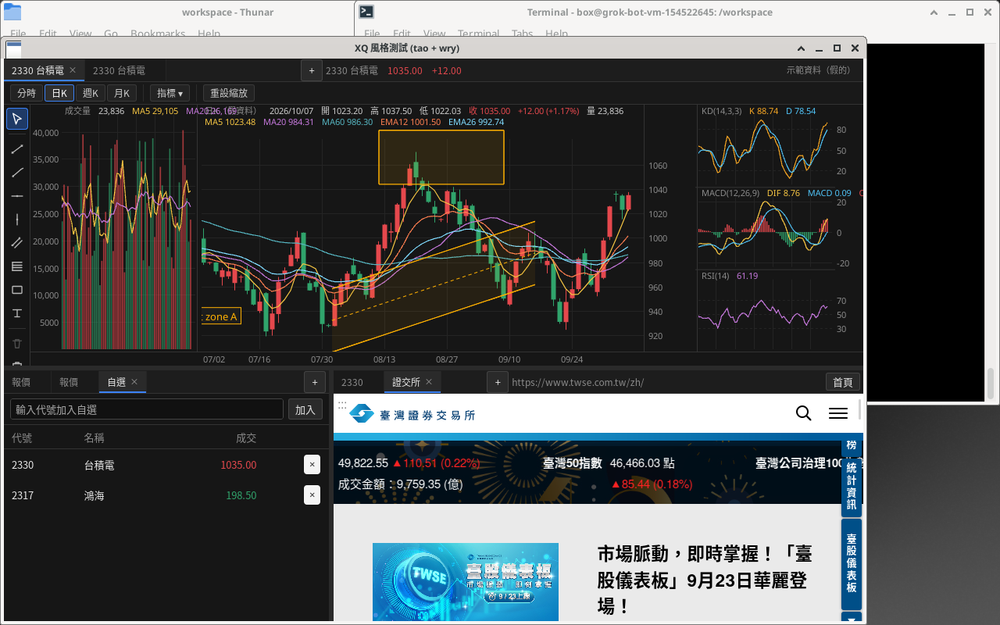

# wry-xq-demo

XQ 風格桌面示範：Rust（**tao** 視窗 + **wry** WebView）開原生視窗，畫面以 HTML／CSS／JS 繪製。



## 架構（tao + wry）

- **主 WebView**：鋪滿視窗，負責三格版面、走勢圖 Canvas、報價／自選／記事、分割線與狀態列。
- **子 WebView**：疊在右下格，載入**真實網站**（不受 `X-Frame-Options` 限制）。JS 以 `ipc` 回報格位像素，Rust 呼叫 `set_bounds` 跟著分割線移動。
- Linux 主畫面走 GTK 嵌入；右下子 WebView 仍為 X11 子視窗（**僅支援 X11**，Wayland 不行）。Windows／macOS 兩個 WebView 皆為視窗子元件。

## 三格版面與分頁

| 區塊 | 分頁 |
|------|------|
| **上** 走勢圖 | 獨立圖表分頁，軟上限 **16**；各分頁自有代號／週期／畫線／指標（鍵：`tabId\|symbol\|period`） |
| **左下** | **報價**、**自選**、**組合**（虛擬化大表）、**記事**（可多開） |
| **右下** 網頁 | 多個網頁分頁共用同一個子 WebView；切換時載入該分頁記住的網址 |

分割線可水平／垂直拖拉；點報價可同步上方圖表與右下網頁。

## 畫線工具列（Longbridge 風格）

走勢圖左側常駐垂直工具列（`draw-rail`）：游標、趨勢線、射線、水平／垂直線、平行通道、費波納契回撤、矩形、文字註記，以及刪除／全部清除。作用中工具會高亮；週期與「指標」仍在上方工具列。

## 技術指標

- **主圖疊加**（overlays）：最多 **20** 組實例，可重複同類型不同參數 — MA、EMA、布林、SAR。
- **副圖**：最多 **10** 格，可設左欄／右欄數量（主圖置中）；指標含成交量、KD、MACD、RSI、威廉、DMI、ATR、OBV。
- 週期：分時／日 K／週 K／月 K。

## 畫線與持久化

畫線與指標、分頁、自選、記事等寫入 `window.XQ_STATE`，經 ipc `{type:"save"}` 由 Rust 存成 JSON：

- Windows：`%APPDATA%\wry-xq-demo\state.json`
- macOS：`~/Library/Application Support/wry-xq-demo/state.json`
- Linux：`$XDG_DATA_HOME/wry-xq-demo/state.json`（或 `~/.local/share/...`）

下次啟動以初始化腳本注入（比 `localStorage` 可靠；WebView2 的 `with_html` 頁面為 `about:blank`）。


## 組合／報價大表（虛擬化）

左下 **組合** 分頁：針對交易室等級的自選／族群表。

- **規模**：單一組合可載入 **5 萬+** 檔（合成假資料做壓力測試；合成組合**不寫入** `state.json`）。
- **欄位**：使用者可增刪／重排／改名／調寬，硬上限 **100** 欄；設定與可編輯組合的代號清單非同步寫入 `state.json`。
- **效能**：列＋欄雙向虛擬化（只建可見 DOM）；行情 tick 只標記髒列、rAF 增量更新可見格；禁止整表重建。
- **編輯**：工具列可加代號、編輯代號清單、編輯欄位；拖曳表頭右緣調寬。
- 壓測：`XQ_GROUP_STRESS=1` 啟動後自動跑 5 萬列 × 多欄 + 高頻 tick + 捲動，結果以 `GROUPPERF|…` 印到 stderr。

## 狀態列

視窗底部顯示 **記憶體**（主行程 + WebView／WebKit 子行程 RSS）、**JS 堆**（有則顯示）、**FPS**（獨立 rAF 計幀）。約每秒更新，**不走行情 tick 熱路徑**。

## 執行

需求：

- **Rust ≥ 1.88**（見 `Cargo.toml` 的 `rust-version`）
- **Windows**：WebView2（Windows 10／11 多半內建）
- **Linux**：WebKitGTK 4.1，嵌入網頁僅 **X11**
- **macOS**：系統 WebKit

```bash
cargo run
# 或
cargo run --release
```

選用環境變數：`XQ_DEBUG=1`（ipc 除錯）、`XQ_TAB_STRESS=1`（16 走勢圖分頁切換壓測）、`XQ_GROUP_STRESS=1`（組合表 5 萬列壓測）。

報價與 K 線皆為**假的示範資料**，不是即時行情。

## 文件

- [效能設計原則](docs/performance-principles.md) — HFT 看盤心態、增量更新、虛擬化、畫線／分頁快取、壓測數字與檢查清單。

## 效能備註（壓力測試摘要）

測試環境：Linux WebKitGTK、無獨立 GPU（偏悲觀；Windows WebView2 + GPU 通常更快）。Canvas 2D。

- **畫線快取**：靜態畫線離屏快取 + 空間索引 hitTest；混合 1000 筆工具重繪約 **15.5 ms → ~0.9 ms**。
- **最重負載**（20 疊加、8 副圖、1000 畫線 + 高頻 tick）：連續 tick 約 **~38 FPS**；十字線+tick ~32 FPS；平移因重建畫線層較慢（~27 FPS）。輕量基準約 60 FPS；RSS 約 600–750 MB（含 WebKit）。
- **組合表**（Linux WebKitGTK）：5 萬列 × 40 欄、~3000 tick/s → **tick ~61 FPS**、捲動 **~55 FPS**、scroll jank 0、可見格重繪 ~1 ms；RSS（含 WebKit）約 **1.1 GB**（合成 5 萬列常駐記憶體）。硬上限 100 欄。
- **16 走勢圖分頁**：切換先貼快照再延遲完整重繪；`paintFirst` 約 **3–4 ms**（p95），settle（含完整 render）約 **~57 ms**。另有 series LRU、平移 translate-cache、指標末棒增量更新等。

## 儲存庫

私人 GitHub 專案：[tina-moneydj/wry-xq-demo](https://github.com/tina-moneydj/wry-xq-demo)（需有權限才能 clone）。
